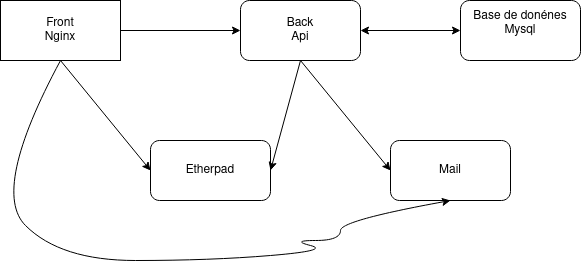

# Projet - TLC

+ Khan Abrar
+ Joua Ali

La machine virtuelle est à l'addresse 148.60.11.47 et le sous-domaine : ozymandias. 

## Tâche 1 

Le Dockerfile pour le front est disponible dans le dossier front. 
De même le Dockerfile pour le back est dans le dossier api. 

Pour lancer : 

-docker build -t doodle/front ./front
-docker build -t doodle/back ./api
-docker-compose up

## Tâche 2

Le routage des requêtes se fait dans le front avec nginx.conf

## Tâche 3

Déploiement sur machine locale, puisque vm inaccessible en ce moment. 

## Tâche 4

